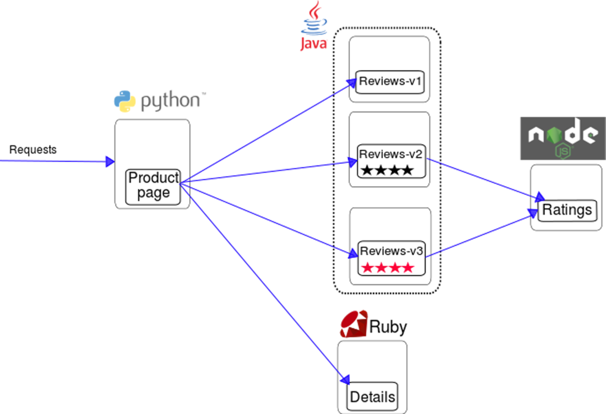

<!SLIDE center full-page background-fit >
!SLIDE[bg=_images/backgrounds/white_bg.png]

~~~SECTION:notes~~~
Here is the architecture of the app we are going to deploy.

As you can see there is a Python frontend, Java and Ruby middleware, with a nodejs backend.

If this isn't a modern microservices application i don't know what is.

I'd like to have yall focus on the "Reviews" section here, there are three different versions,
one without stars v1, one with black stars, v2 and finally one with red stars v3.

These are the services we are going to manipulatiate.

~~~ENDSECTION~~~

